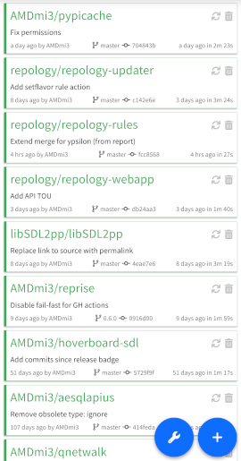

# GitHub Actions STatus webapp

This is a simple backendless webapp which shows statuses of GitHub
action runs for selected repositories, kind of how Travis-CI shows
its jobs.

The running instances are:
- [ghast.apps.amdmi3.ru](https://ghast.apps.amdmi3.ru) - stable
- [dev.ghast.apps.amdmi3.ru](https://devel.ghast.apps.amdmi3.ru) - devel

## Features

- Add any number of public GitHub repositories.
- Shows latest run status and duration, and commit hash, date,
  author and message for the commit which triggered the run.
- Smart update logic which updates status of in-progress runs
  each minute, recently updated repositories every 5 minutes
  and repositories not updated for a long time every hour. This
  conserves traffic, battery life and GitHub requests which are
  limited by 60 per hour.
- It's possible to trigger an update manually (note though that
  GitHub API sets 60 second caching, so it's pointless to update
  more frequent that once a minute.
- Repositories state is stored in browser's local storage.

## TODO

- Icon.
- Proper PWA with web worker, background operation and notifications.
- Optional authorization in GitHub which would allow
- More settings, such as per-repository update periods.
- Settings import/export.
- Better UX.

## Installation

The app may be served right from the checkout, just point any
HTTP server at it.

## License

GPLv3 or later, see [LICENSE](LICENSE).
